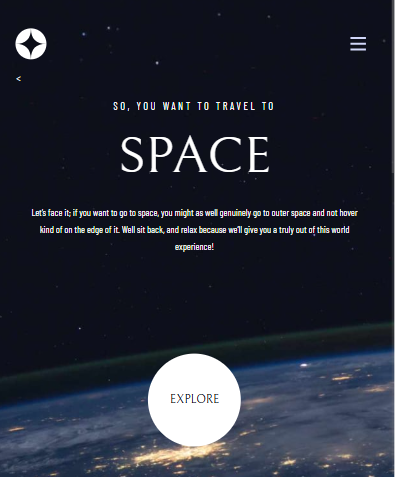

# Frontend Mentor - Space tourism website solution

This is a solution to the [Space tourism website challenge on Frontend Mentor](https://www.frontendmentor.io/challenges/space-tourism-multipage-website-gRWj1URZ3). Frontend Mentor challenges help you improve your coding skills by building realistic projects. 

## Table of contents

- [Overview](#overview)
  - [The challenge](#the-challenge)
  - [Screenshot](#screenshot)
  - [Links](#links)
  - [Built with](#built-with)
  - [Continued development](#continued-development)
- [Author](#author)

**Note: Delete this note and update the table of contents based on what sections you keep.**

## Overview

### The challenge

Users should be able to:

- View the optimal layout for each of the website's pages depending on their device's screen size
- See hover states for all interactive elements on the page
- View each page and be able to toggle between the tabs to see new information

### Screenshot
#### Home Page

#### Destination Page

#### Crew Page

#### Technology Page

#### Tablet View

#### Mobile View

#### Mobile View (Sidebar Active)

### Links

- Live Site URL: [Add live site URL here](https://space-tourism-website-main-l8yn.vercel.app/)

### Built with

- Semantic HTML5 markup
- CSS custom properties
- Flexbox
- CSS Grid

### Continued development

I want to focus on making this single page application and not to repeat the code again and again.
Want to learn more about figma and how to use given dimensions dynamically.

## Author

- LinkedIn - [Lakshya Tyagi](https://www.linkedin.com/in/lakshya-tyagi-50341517b/)
- Frontend Mentor - [@lakshya142000](https://www.frontendmentor.io/profile/lakshya142000)
- Github -[@lakshya142000](https://github.com/lakshya142000)

